# DLIM

Deep Learning Pix2Pix model for image generation.

Manual Drawing or image to Japanese (18s) drawing.

The code contains scraper to generate the dataset. It also contains scripts to resize the original Japanese printing without detroying the picture


# RESULTS

Input             |  Generated
:-------------------------:|:-------------------------:
  |  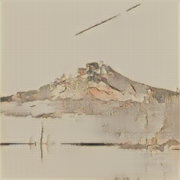
  |  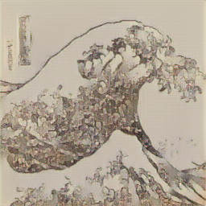
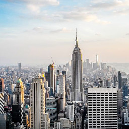  |  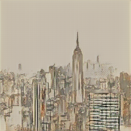
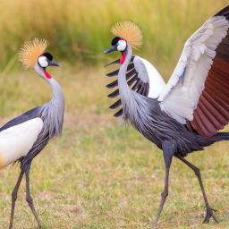  |  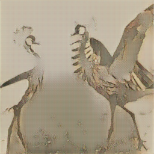
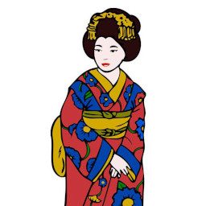  |  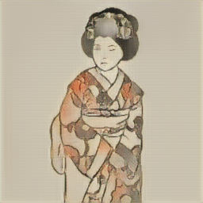
  |  
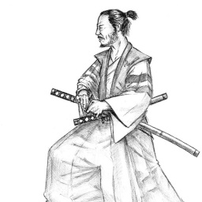  |  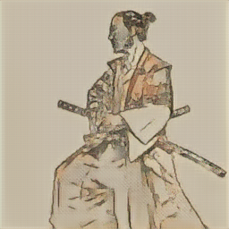
  |  
  |  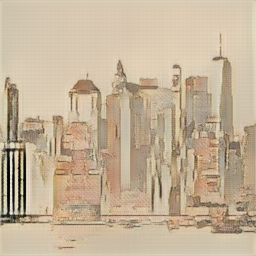
  |  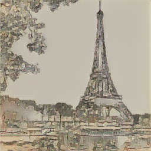
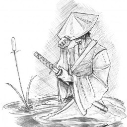  |  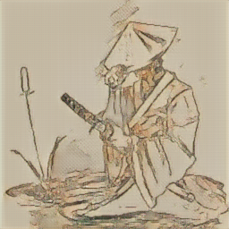


# Dataset / Pretrained weights

The dataset ccan be found in the following link and the pretrained weights for the models.

https://drive.google.com/drive/folders/1iVbeJLTqT5NTXkpj-LnBfecVP41YhX3a?usp=sharing


# Launch

Before launching the algorithm you need to have pretrain weights from the generator:

```
model/gen.pth.tar
```

Moreover, you need to have installed the dependencies detailed in the requirements.txt

To launch the model on a new image:

```
python src/gen_paintings.py <path_to_img>
```

Two images will be generated:

- edges.jpg (Containing the edges extraction with Canny algorithm)
- save.png (Containing the generated printing in japanese style)
